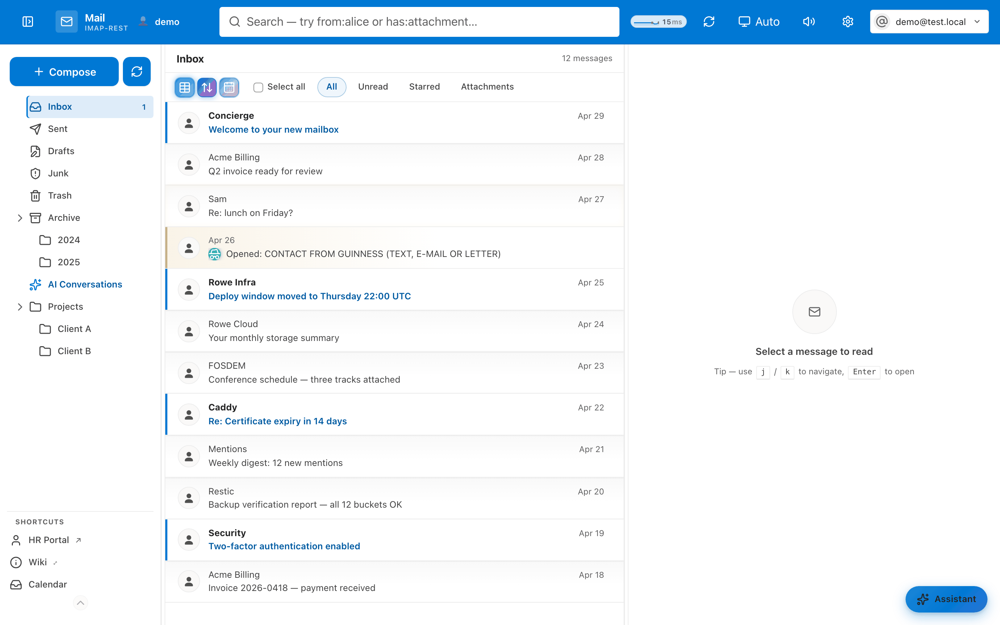

# 📮 mailcow-rest-api (Mailcow addon)

**One container. Your whole mailbox as an API — plus a webmail.**

Turns a mailcow mailbox into a REST + OpenAPI surface for automation, MCP clients, and the bundled webmail. No second container, no separate frontend deploy.

| Path | What you get |
|---|---|
| `/v1/*` | 🔌 REST API — IMAP, SMTP, Sieve, CalDAV, mailcow's own DB |
| `/` | 📖 Swagger UI (`/openapi.json` for the raw spec) |
| `/webmail/` | 📧 Bundled webmail (`/webmail/mobile/` for the PWA) |
| `/v1/admin/*` | 🛠️ Operator settings, when `ADMIN_TOKEN` is set |

## 🚀 Quick start

On a mailcow host:

```sh
curl -fsSL https://raw.githubusercontent.com/jr551/mailcow-rest-api/master/install/quickstart.sh | sudo sh
```

Then open `https://<your-mailcow-host>/mailcow-rest-api/` — Swagger UI is right there.

Or plain Docker:

```sh
docker run --rm -p 3001:3001 \
  -e IMAP_HOST=dovecot-mailcow \
  -e SMTP_HOST=postfix-mailcow \
  ghcr.io/jr551/mailcow-rest-api:master
```

## ✨ What it does

| Area | What you get |
|---|---|
| 📬 Mail | Read, search, move, flag, delete, send, attachments, raw source |
| 🤖 AI | Inbox sort, summarize, draft reply, phishing scan, link-safety check, translate (server-proxied, the provider key never reaches the browser) |
| 🔗 Webhook inboxes | Give a service a URL, its POSTs land in your INBOX |
| 📤 Outbound webhooks | A mail-rule action POSTs matching mail (headers, body, attachments) to your URL |
| 🔑 Agent links | One click → a 24 h pasteable credential for MCP/scripts |
| 📅 Calendar | SOGo CalDAV events, iCal publishing, public edit links |
| 🚫 Rules & policies | Sieve mail rules, sender allow/block, blocked recipients |
| 📁 Drive | Optional S3/B2-backed file storage for the browser |
| 🔔 Push | Web-push subscriptions + notification polling |
| 🛡️ Safety | IP allowlists, per-IP rate limiting, credential encryption at rest |
| 🧩 MCP | `bin/imap-rest-mcp` stdio adapter for agent tooling |

## 📧 The webmail



Ships in the image at `/webmail/` — sign in with a mailcow mailbox address + password. Two skins: **Outlook** (default) and **Gmail**, each with its own light *and* dark palette and a customisable accent colour, plus a custom-CSS box under **Settings → Appearance**. The topbar toggle switches light/dark on either skin, and on **auto** it follows your OS. More detail in [`webmail/README.md`](webmail/README.md).

<details>
<summary><b>Self-hosting, CDN builds, and the mailcow sign-in button</b></summary>

**Same-origin (default).** The SPA is built from `webmail/` into the image, so the API always serves the frontend it was built with. `window.__IMAP_API_BASE__` defaults to `""` — no CORS, no second vhost.

**CDN / separate hosting.** `cd webmail && npm ci && npm run build` (output in `webmail/dist`), host it on Cloudflare Pages, Netlify, or S3/CloudFront, then point it at a remote API by editing the shell's inline script in `dist/index.html` (and `dist/mobile/index.html`):

```html
<script>window.__IMAP_API_BASE__ = "https://userapi.example.com"</script>
```

…and add that origin to `API_CORS_ORIGINS` on the API.

**A button on mailcow's own login page.** `install/webmail-handoff.js` plus the nginx snippet in `install/webmail-handoff.nginx.example` add a **New webmail** button next to mailcow's sign-in form; it exchanges the typed credentials for a session token and hands it to the SPA in the URL fragment. Injected by the reverse proxy, not into mailcow's tree (which `update.sh` resets).

**Turning it off.** `WEBMAIL_ENABLED=false` removes the webmail at startup. With `ADMIN_TOKEN` set you can also toggle it at runtime via the admin API — immediate, no container recreate.

</details>

<details>
<summary><b>🔑 App passwords &amp; agent access links</b></summary>

Pointing an MCP client or a script at a mailbox normally means putting the mailbox password in a config file, where it grants IMAP, SMTP, and webmail access indefinitely and can only be withdrawn by changing the password everywhere it is used. An app password is a per-client credential instead: users create them under **Settings → Security → Agent access link**, which mints a 24-hour, unpinned token and hands back a pasteable URL — the token rides in the `#agent=` fragment so it never reaches a server log, and the same card lists every live credential with its last-used IP and a revoke button.

Use it wherever the mailbox password would go — as the password with the address as username, or as a bearer token on its own:

```sh
curl -u 'user@example.com:map_...' https://api.example.com/v1/mailboxes
curl -H 'Authorization: Bearer map_...' https://api.example.com/v1/mailboxes
```

For MCP, put it in `IMAP_REST_PASS`:

```json
{
  "mcpServers": {
    "mailcow-rest-api": {
      "command": "npx",
      "args": ["--yes", "--package", "mailcow-rest-api", "imap-rest-mcp"],
      "env": {
        "IMAP_REST_BASE_URL": "https://api.example.com",
        "IMAP_REST_USER": "user@example.com",
        "IMAP_REST_PASS": "map_..."
      }
    }
  }
}
```

- **IP scoping is mandatory.** At least one address or CIDR is required, and a token presented from anywhere else is rejected exactly like a wrong password — what makes a leaked token far less useful than a leaked mailbox password.
- **Only the hash is stored,** so a stolen database yields no usable token.
- **They cannot manage themselves.** An app password may not create or revoke app passwords — otherwise a leaked one could issue a replacement scoped to the attacker's own network and survive revocation of the original. Managing them requires signing in with the mailbox password.
- **Revocation is immediate,** each row records when and from where it was last used, and expiry in days is optional on top.

Because minting performs a real IMAP login, the mailbox password is captured at that moment and kept encrypted with `CREDENTIAL_ENCRYPTION_KEY` — so the feature requires credential encryption, is disabled without it, and **a mailbox password change invalidates existing app passwords**. Recreate them, or sign in to the webmail once to re-key them.

</details>

<details>
<summary><b>🔗 Webhook inboxes</b></summary>

The reverse of a mail rule: give an external service a URL and anything it POSTs lands in your INBOX as an email. Users mint them under **Settings → Security → Webhook inboxes**; the URL is shown once, at creation.

```sh
curl -X POST https://api.example.com/v1/hook/whi_... \
  -H 'content-type: application/json' \
  -d '{"alert":"disk 90% on nas"}'
```

The subject comes from `?subject=`, an `X-Webhook-Subject` header, or a `subject`/`title` field in a JSON body — otherwise it falls back to the inbox label. The body becomes the message text. Delivery is a real IMAP APPEND, so the mail behaves like any other: filters, push, and notifications all apply.

Because the ingest path needs the mailbox password to APPEND, webhook inboxes share the app-password plumbing: the password is stored encrypted with `CREDENTIAL_ENCRYPTION_KEY`, the feature is disabled without it, and a password change invalidates existing inboxes until the user signs in once to re-key them. `WEBHOOK_INBOXES_ENABLED=false` turns the whole surface off; `WEBHOOK_INBOXES_MAX_PER_USER` caps how many each mailbox may hold (default 10).

</details>

<details>
<summary><b>🛠️ Admin API</b></summary>

Setting `ADMIN_TOKEN` enables `/v1/admin/*`. Without it the routes are never registered. The token is operator credentials, not a mailbox login, and is sent as `Authorization: Bearer <ADMIN_TOKEN>`.

```sh
# current settings
curl -H "Authorization: Bearer $ADMIN_TOKEN" https://api.example.com/v1/admin/settings

# take the webmail offline without touching the container
curl -X PUT -H "Authorization: Bearer $ADMIN_TOKEN" -H 'content-type: application/json' \
  -d '{"webmail":{"enabled":false}}' https://api.example.com/v1/admin/settings
```

`GET /v1/admin/status` reports version, uptime and which optional subsystems are live; settings persist in `admin-settings.db` on the data volume. Generate a real token with `openssl rand -hex 32`, and restrict it by source IP when the API is publicly reachable.

</details>

<details>
<summary><b>📋 Full API surface</b></summary>

The Swagger UI is the source of truth for schemas and response examples. This route list shows the whole surface at a glance.

**Public and docs**

| Method | Path | Purpose |
|---|---|---|
| `GET` | `/` | Swagger UI |
| `GET` | `/openapi.json` | Raw OpenAPI 3.1 document |
| `GET` | `/health` | Liveness/health check |
| `GET` | `/webmail/` | Bundled webmail SPA (`/webmail/mobile/` for the mobile PWA) |

**Admin**

| Method | Path | Purpose |
|---|---|---|
| `GET` | `/v1/admin/status` | Version, uptime, subsystem status |
| `GET` | `/v1/admin/settings` | Read runtime settings |
| `PUT` | `/v1/admin/settings` | Update runtime settings |

**Auth and session**

| Method | Path | Purpose |
|---|---|---|
| `POST` | `/v1/auth/session` | Exchange credentials for a session token |
| `DELETE` | `/v1/auth/session` | Sign out |
| `GET`/`POST`/`DELETE` | `/v1/me/app-passwords*` | List, mint, revoke app passwords |
| `GET`/`POST`/`DELETE` | `/v1/me/webhook-inboxes*` | List, mint, revoke webhook inboxes |
| `POST` | `/v1/hook/{token}` | Webhook ingest — POST lands in the owner's INBOX |

**Mailboxes and messages**

| Method | Path | Purpose |
|---|---|---|
| `GET` | `/v1/mailboxes` | List the mailbox tree |
| `GET` | `/v1/mailboxes/{path}/messages` | List/search messages |
| `GET` | `/v1/mailboxes/{path}/messages/{uid}` | Read message detail |
| `GET` | `/v1/mailboxes/{path}/messages/{uid}/raw` | Raw RFC 822 source |
| `GET` | `/v1/mailboxes/{path}/messages/{uid}/attachments/{id}` | Download an attachment |
| `GET` | `/v1/mailboxes/{path}/messages/{uid}/attachments/{id}/text` | Extract attachment text/OCR |
| `PUT` | `/v1/mailboxes/{path}/messages/{uid}/flags` | Set message flags |
| `PUT` | `/v1/mailboxes/{path}/messages/{uid}/move` | Move a message |
| `DELETE` | `/v1/mailboxes/{path}/messages/{uid}` | Delete a message |
| `POST` | `/v1/mailboxes/{path}/messages` | Append a message |
| `POST` | `/v1/send` | Send mail (draft/reply metadata, pending approvals) |

**Account, rules, and sender policy**

| Method | Path | Purpose |
|---|---|---|
| `GET` | `/v1/me` | Mailbox profile |
| `GET` | `/v1/me/aliases` | Aliases |
| `GET`/`POST`/`DELETE` | `/v1/me/temp-aliases*` | Temporary aliases |
| `GET`/`POST`/`DELETE` | `/v1/me/sender-policy*` | Allow/block sender lists |
| `GET`/`POST`/`DELETE` | `/v1/me/mail-rules*` | Sieve-backed mail rules |
| `GET`/`POST`/`DELETE` | `/v1/me/blocked-recipients*` | Blocked recipients |
| `GET` | `/v1/me/logins` | Recent logins |

**Calendar**

| Method | Path | Purpose |
|---|---|---|
| `GET` | `/v1/me/calendars` | List SOGo calendars |
| `GET`/`POST` | `/v1/me/calendars/{id}/events*` | Event list/create |
| `PUT`/`DELETE` | `/v1/me/calendars/{id}/events/{uid}` | Event update/delete |
| `GET`/`POST`/`DELETE` | `/v1/me/calendars/{id}/ical-token` | Public iCal feed token |
| `GET`/`PUT` | `/v1/ical/{token}*` | Public feed + event edit links |

**Drive, push, proxy, tracking, telemetry, and AI**

| Method | Path | Purpose |
|---|---|---|
| `GET`/`PUT` | `/v1/me/drive*` | Drive config and quota |
| `POST`/`DELETE` | `/v1/me/push*` | Web-push subscriptions |
| `GET` | `/v1/me/notifications` | Poll notifications |
| `GET` | `/v1/proxy/icon` | Sender-avatar icon proxy (allowlisted) |
| `GET` | `/v1/proxy/image` | Remote image proxy |
| `GET`/`POST` | `/v1/me/tracking*` | Tracking pixels and events |
| `POST` | `/v1/telemetry` | Client telemetry |
| `GET` | `/v1/ai/capabilities` | AI feature flags |
| `GET` | `/v1/ai/config` | Client-usable AI endpoint (proxied) |
| `POST` | `/v1/ai/summarize` | Summarize text |
| `POST` | `/v1/ai/draft-reply` | Draft a reply |
| `POST` | `/v1/ai/actions` | Extract actions |
| `POST` | `/v1/ai/translate` | Translate text |
| `POST` | `/v1/ai/sort-inbox` | Rank inbox messages |
| `POST` | `/v1/ai/phishing-scan` | Phishing verdict |
| `GET` | `/v1/ai/tts-config` | TTS config |
| `POST` | `/v1/ai/web-search` | Web search |
| `POST` | `/v1/ai/llm/chat/completions` | Same-origin OpenAI-compatible proxy |

</details>

<details>
<summary><b>⚙️ Configuration</b></summary>

Copy `.env.example` to `.env`. Common values:

| Variable | Default | Notes |
|---|---|---|
| `PORT` | `3001` | API listen port inside the container |
| `IMAP_HOST` | `dovecot-mailcow` | mailcow Dovecot container/service |
| `SMTP_HOST` | empty | Set to `postfix-mailcow` for send support |
| `MAILCOW_DB_HOST` | `mysql-mailcow` | Used for account, alias, and policy features |
| `SOGO_URL` | empty | Set to `http://nginx-mailcow/SOGo` for CalDAV |
| `LLM_PROVIDER` | `openai` | `openai` or `anthropic` |
| `LLM_BASE_URL` | empty | OpenAI-compatible proxy/provider URL |
| `LLM_API_KEY` | empty | Provider key; stays server-side (chat is proxied via `/v1/ai/llm`) |
| `LLM_REASONING_EFFORT` | `none` | Reasoning budget; `none` keeps short answers from being eaten by thinking tokens |
| `LLM_SCRUB_SECRETS` | `true` | Strip credentials from prompts before they reach the provider |
| `LLM_DECOY_COUNT` | `0` | Decoy requests per real one; multiplies token spend |
| `AI_CACHE_TTL_MS` | `43200000` | Per-user completion cache TTL (12h); `AI_CACHE_ENABLED=false` to disable |
| `S3_DRIVE_ENABLED` | `false` | Enables drive config/quota endpoints |
| `VAPID_PUBLIC_KEY` / `VAPID_PRIVATE_KEY` | empty | Enables push delivery |
| `RATE_LIMIT_MAX` / `RATE_LIMIT_WINDOW_MS` | `300` / `60000` | Per-IP request cap; `RATE_LIMIT_ENABLED=false` to disable |
| `TRUST_PROXY` | private hops | Which proxies may set `X-Forwarded-For`; never trusts arbitrary clients |
| `CREDENTIAL_ENCRYPTION_KEY` | generated | Encrypts stored mailbox passwords at rest; set it so backups don't carry the key |
| `WEBHOOK_ACCOUNTS` | empty | JSON array of mailboxes whose mail is POSTed to a webhook and then deleted |
| `WEBHOOK_INBOXES_ENABLED` | `true` | User-minted POST→INBOX URLs; needs `CREDENTIAL_ENCRYPTION_KEY` |
| `WEBHOOK_INBOXES_MAX_PER_USER` | `10` | Per-mailbox cap on webhook inboxes |
| `DRIVE_CORS_ORIGINS` | `PUBLIC_BASE_URL` | Browser origins allowed to reach Drive buckets (required for Drive to work) |
| `WEBMAIL_ENABLED` | `true` | Serve the bundled SPA at `/webmail/`; `false` is a hard off switch the admin API cannot undo |
| `WEBMAIL_DIST` | `/app/webmail/dist` | Where the built SPA lives; the image sets this for you |
| `ADMIN_TOKEN` | empty | Bearer token for `/v1/admin/*`; unset leaves the admin routes unregistered |
| `ADMIN_IP_ALLOWLIST` | empty | Optional CIDR list restricting `/v1/admin/*` on top of the token |
| `ADMIN_SETTINGS_DB_PATH` | `<data>/admin-settings.db` | Runtime operator settings store |

**Webhook conversion accounts**

Set `WEBHOOK_ACCOUNTS` to turn a mailbox into a feed for some other system. Every message that arrives is POSTed as JSON — envelope, decoded `text`/`html` bodies, attachments with their bytes (base64), and the full RFC822 source for receivers that would rather parse MIME themselves — and is then deleted from the mailbox.

Each attachment carries `filename`, `contentType`, `size`, `included` and either `content` (base64) or an `omittedReason`; anything over `WEBHOOK_MAX_ATTACHMENT_BYTES` (10 MB) or past the per-message budget (`WEBHOOK_MAX_ATTACHMENTS_TOTAL_BYTES`, 20 MB) is listed and explained rather than dropped silently.

```json
[
  {
    "address": "forms@example.com",
    "password": "the mailbox's IMAP password",
    "url": "https://hooks.example.com/mail",
    "secret": "optional-hmac-secret",
    "mailbox": "INBOX",
    "headers": { "Authorization": "Bearer …" }
  }
]
```

`headers` is optional and merged into every POST for that account — `Authorization` is the usual case. Reserved transport names (`host`, `content-length`, `transfer-encoding`, …) and `x-webhook-*` are rejected; an invalid `headers` block is dropped with a warning rather than disabling the account.

A message is deleted **only** after the webhook answers 2xx. Anything else leaves it in the mailbox and schedules a retry — 1m, 5m, 15m, 1h, 3h, 6h, 12h, then daily, up to `WEBHOOK_MAX_ATTEMPTS` (default 14) — with attempt state in `WEBHOOK_DB_PATH` so restarts neither reset the backoff nor re-deliver. After the final attempt the message is left in place.

When `secret` is set, each POST carries:

```
X-Webhook-Timestamp: <unix seconds>
X-Webhook-Signature-V2: <hex HMAC-SHA256 of "<timestamp>.<raw body>">
```

Verify the signature against the raw request body, not a re-serialized copy, and reject any request whose timestamp is outside your tolerance window (300s is a reasonable default) — that check is what makes a captured request unreplayable. No body-only `X-Webhook-Signature` is sent: emitting one alongside the timestamped signature would let an attacker strip the two headers above and replay the request anyway.

</details>

<details>
<summary><b>📤 Outbound webhooks</b> — email → your URL, driven by a mail rule</summary>

Create one under **Settings → Outbound webhooks**, then point a mail rule's "Send to external webhook" action at it (optionally keeping the message in the mailbox). Each delivery POSTs the envelope, parsed headers, text/HTML bodies, a prepend note you can set per webhook, optional custom request headers (`headers`, e.g. `{"Authorization":"Bearer …"}` — stored encrypted, listed masked, same reserved-name rules as `WEBHOOK_ACCOUNTS`), and gzip+base64 attachments with decode instructions for the receiver. A Sent-folder receipt records the outcome.

Each card has a **Send test** button. It POSTs a synthetic payload through the *same* delivery code the background worker uses — same signature scheme, same header merge, same pinned connection — and reports the receiver's HTTP status, timing and the first 300 characters of its reply. It reads no message, consumes nothing, leaves the delivery queue untouched, and never returns the signing secret or the stored header values. A non-2xx is shown as a result, not an error: the receiver rejecting the request is exactly what you needed to see.

| Variable | Default | Notes |
|---|---|---|
| `OUTBOUND_WEBHOOKS_ENABLED` | `true` | Master switch for `/v1/me/outbound-webhooks` |
| `OUTBOUND_WEBHOOKS_MAX_PER_USER` | `100` | Per-mailbox cap |
| `OUTBOUND_WEBHOOK_POLL_INTERVAL_MS` | `60000` | How often hidden `.wh-*` mailboxes are drained |
| `OUTBOUND_WEBHOOK_MAX_ATTEMPTS` | `14` | Retry budget with backoff |
| `OUTBOUND_WEBHOOK_MAX_MESSAGE_BYTES` | `26214400` | Skip forwarding past this |

</details>

<details>
<summary><b>📦 Mailcow setup details</b></summary>

The setup scripts are intentionally conservative: before they start containers or write nginx config they run `install/mailcow-safety-check.sh`, which verifies Docker, Docker Compose, a mailcow checkout, the mailcow network, the nginx config directory, and running `nginx-mailcow`, `dovecot-mailcow` and `postfix-mailcow` containers.

Manual install:

```sh
git clone https://github.com/jr551/mailcow-rest-api.git /opt/mailcow-rest-api
cd /opt/mailcow-rest-api
cp .env.example .env
sudo install/mailcow-safety-check.sh
sudo install/setup.sh
```

The default setup exposes the API through mailcow nginx at `https://<your-mailcow-host>/mailcow-rest-api/` (plus `/openapi.json` and `/health` under the same prefix).

Set `MAILCOW_PATH` if your mailcow checkout is not `/opt/mailcow-dockerized`, and set `MAILCOW_NETWORK` if your Docker network name differs from `mailcowdockerized_mailcow-network`.

Install this checkout outside of `/opt/mailcow-dockerized` (e.g. as a sibling directory like `/opt/mailcow-rest-api`) so mailcow's own `update.sh` — which resets its working tree — never touches it.

For production edge hardening (rate limiting, security headers, ban coverage), see [`docs/deployment-hardening.md`](docs/deployment-hardening.md).

</details>

## 🤖 AI assistant takeover

An opt-in mode where the webmail assistant works through your unread mail and drafts replies in your voice. **It never sends anything.** Every draft becomes an approval request that lands in your own inbox with an approve/deny link — the same gate that has always held API and MCP sends.

Turn it on under **Settings → AI → AI assistant takeover**. It is off by default, and `TAKEOVER_ENABLED=false` disables the feature entirely at the server.

**What it does, in order.** It looks at unread INBOX mail and works out which messages a real person is actually waiting on — skipping newsletters, receipts, shipping notices, calendar invites, monitoring and CI mail, bounces, auto-replies and anything from a no-reply address. For the rest it drafts a short reply, and hands that draft to you for approval.

**The rules are enforced in code, not just in the prompt:**

| Rule | How it is enforced |
|---|---|
| At most one reply per hour | blocked before any model is called, and the hold is recorded with its reason |
| At least five minutes' delay | a younger message is held, with the wait stated in minutes; `5` is the floor and cannot be lowered |
| No invented facts | money, percentages, dates, times and reference numbers in a draft are checked against the thread and your instructions; anything unsupported becomes a question to you instead of a claim to them |
| No replies to machines | the automated-sender check runs before any model call at all |
| Fail closed | an answer the assistant cannot parse stops it rather than guessing, and a request for information always beats a draft |

**The sign-off.** Every reply ends with exactly one line — `This reply came from my AI assistant.` — and nothing else. There is deliberately no disclaimer block.

**When it cannot continue**, it stops and says why rather than bluffing. Opening the inbox shows a window listing what is missing and offering two choices:

- **Resume with advice** — you write the answer, which is fed back in as context. The next draft still comes to you for approval.
- **Stop** — the item is closed and the message is marked done, so it is never touched again.

**What it will not do.** It will not send without your click. It will not invent a date, price, order number or policy. It will not reply to a newsletter or an alert. It will not pretend to be you.

Tuning: `TAKEOVER_MAX_REPLIES_PER_HOUR` (default `1`, `0` pauses it entirely), `TAKEOVER_MIN_DELAY_MINUTES` (default `5`, floor `5`), `TAKEOVER_LOOKBACK_HOURS`, `TAKEOVER_POLL_INTERVAL_MS`. See `.env.example`.

> A note on what approval actually means: an approval link works for one hour, and every pending approval is lost when the service restarts. If a link has gone stale the page says plainly that **nothing was sent**.

## 🧪 Development

```sh
npm install && npm test && npm start   # Swagger at http://localhost:3001/
```

Run the MCP adapter locally:

```sh
IMAP_REST_BASE_URL=http://127.0.0.1:3001 \
IMAP_REST_USER=user@example.com \
IMAP_REST_PASS='mailbox-password' \
npm run mcp
```

The webmail is a separate workspace with its own checks. From `webmail/`:

```sh
npm install
npm run check                     # svelte-check
npm run build                     # the SPA the image serves
node --test test/unit/*.test.mjs  # unit — there is no `npm test` script here
npm run test:e2e                  # playwright; builds first, never reuses a server
```

### Releasing

The version in `package.json` is the single source of truth. A release is
bump → commit → tag → GitHub release; the `v*` tag is what publishes the
image, so the tag and the version must agree.

```sh
# 1. On a clean master, bump and commit.
npm version 0.22.0 --no-git-tag-version
git commit -am 'chore(release): v0.22.0'

# 2. Tag and push. The tag triggers publish-image (amd64, tags `latest`).
git tag v0.22.0 && git push origin master v0.22.0

# 3. Wait for publish-image, then create the release page. The project's
#    convention is `vX.Y.Z — short summary` with a bullet per user-visible
#    change; write it from the actual commits, not from memory.
gh run watch "$(gh run list --workflow publish-image --limit 1 \
  --json databaseId -q '.[0].databaseId')" --exit-status
gh release create v0.22.0 --title 'v0.22.0 — …' --notes-file notes.md

# 4. Deploy. The host pulls `:master`, so it is the same image the tag
#    published once the publish run has finished.
ssh root@<mail-host> 'cd /opt/imap-rest-mailcow && \
  docker compose pull imap-rest && docker compose up -d imap-rest'
curl -s https://<api-host>/health | head -c 80
```

Deploying before `publish-image` completes pulls the *previous* image
without complaint — the compose file tracks `:master`, not the version, so
the health check reporting the old `version` is the only signal that the
step order was wrong.

#### What the gates are

Before a release, all of these must be green, and they must be green
*together* rather than individually:

| Gate | Command | Cost |
|---|---|---|
| Server unit | `npm test` | ~10s |
| Webmail unit | `cd webmail && node --test test/unit/*.test.mjs` | ~5s |
| Types | `cd webmail && npx svelte-check --threshold error` | ~15s |
| Build | `cd webmail && npm run build` | ~10s |
| E2E | `cd webmail && npm run test:e2e` | ~3min |

CI runs the same set. The e2e job is the slow one and the one that
matters most: a suite that passes against a stale build is worse than no
suite, which is why `playwright.config.ts` builds first and never reuses
an existing preview server.
