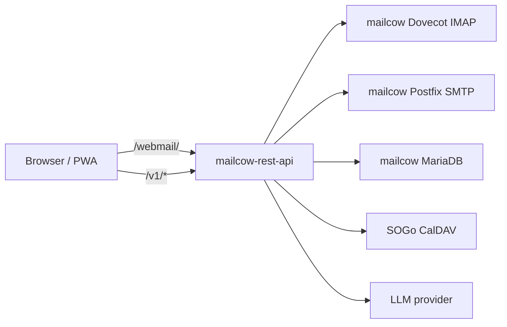
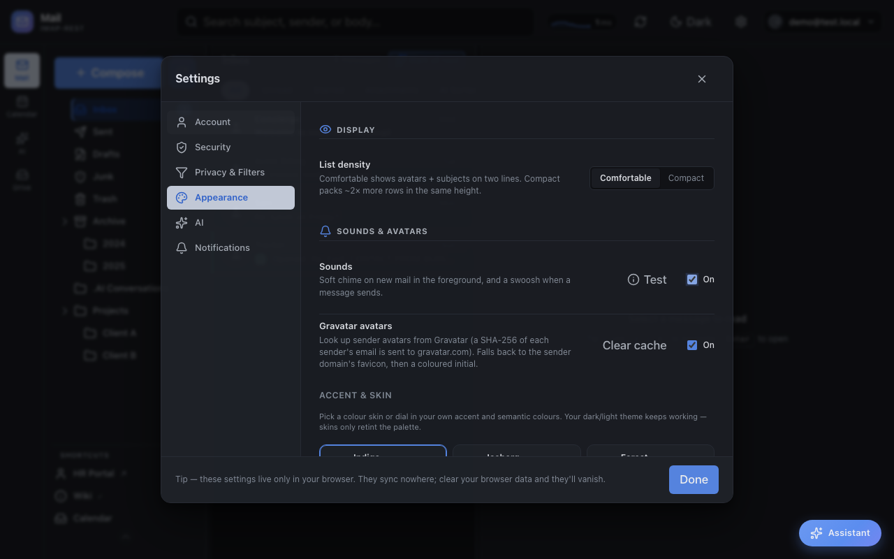
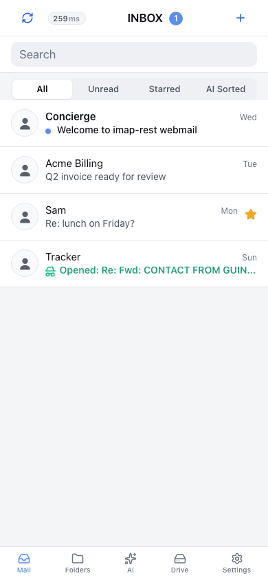

# Webmail (embedded SPA)

The Svelte 5 webmail frontend for [`mailcow-rest-api`](https://github.com/jr551/mailcow-rest-api). It provides a desktop mail UI plus a mobile/PWA experience styled around an iOS Mail-like flow.

**Alpha:** public and usable, but still an alpha webmail client. Expect fast changes and rough edges in some workflows.

This directory is part of the `mailcow-rest-api` repository, not a separate deployment. The API image builds it and serves the result at `/webmail/`, so there is nothing to deploy on its own and no version skew between the API and the frontend. See the [root README](../README.md) for running the container, and for hosting a build on a CDN instead.


## Architecture



This is a static client-side app — all mailbox and AI processing happens in the API. The API serves the built files itself, so the SPA and the API it calls are the same origin and no CORS configuration is involved.

## AI And Key Privacy

The browser never receives a provider API key. AI requests go to
`POST /v1/ai/llm/chat/completions` on `mailcow-rest-api`, authenticated with
the session token the client already holds; the server attaches the provider
key and forwards the request. `GET /v1/ai/config` reports `proxied: true` and
a same-origin base URL, so the client treats it like any other
OpenAI-compatible endpoint. My deployment uses DeepSeek V4 Flash.

This replaces an earlier design that brokered per-user scoped keys through
LiteLLM and shipped them to the browser. Handing a key of any kind to a public
static frontend means anyone who can read the page can use it, so the key now
stays server-side and the session is the only credential the client holds.

Browser-local user keys still work for personal use (Settings → AI), but they
are not a safe way to distribute one shared key to all users.

## Screenshots

Message reading:


AI assistant panel:


Compose:


PWA install/settings:



Mobile inbox snapshot:



## What It Includes

- Desktop mailbox UI with folders, search, filters, message detail, attachments, compose, reply, forward, and multi-account affordances.
- Calendar and drive views backed by the REST API.
- AI assistant workflows for summarising, drafting, sorting, actions, translation, phishing checks, and voice/TTS where configured.
- Tracking, sender policy, blocked-recipient, shortcuts, settings, density, theme, and PWA install surfaces.
- Mobile entry point at `/webmail/mobile/` with an iOS Mail-inspired layout for inbox, message reading, compose, folders, and settings.

## Development

```sh
npm install
VITE_DEV_API_TARGET=http://localhost:3001 npm run dev
npm run check
npm run build
```

Run these from this `webmail/` directory. `VITE_DEV_API_TARGET` points the Vite dev proxy at a local API; in production the API serves the built files directly and no proxy is involved.

`npm run build` writes to `webmail/dist/`. The image's build stage runs exactly this, so a local `dist/` is only for testing — it is excluded from the Docker context and never ends up in a published image.

To test a build the way production serves it, point the API at it:

```sh
cd .. && WEBMAIL_DIST=./webmail/dist npm start
# then open http://localhost:3001/webmail/
```

The API Swagger UI lives at `/` on the API service, or `/mailcow-rest-api/` if you use the public API setup script from the API repo.
