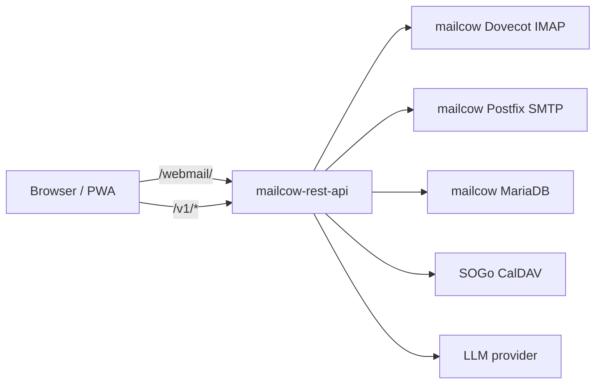
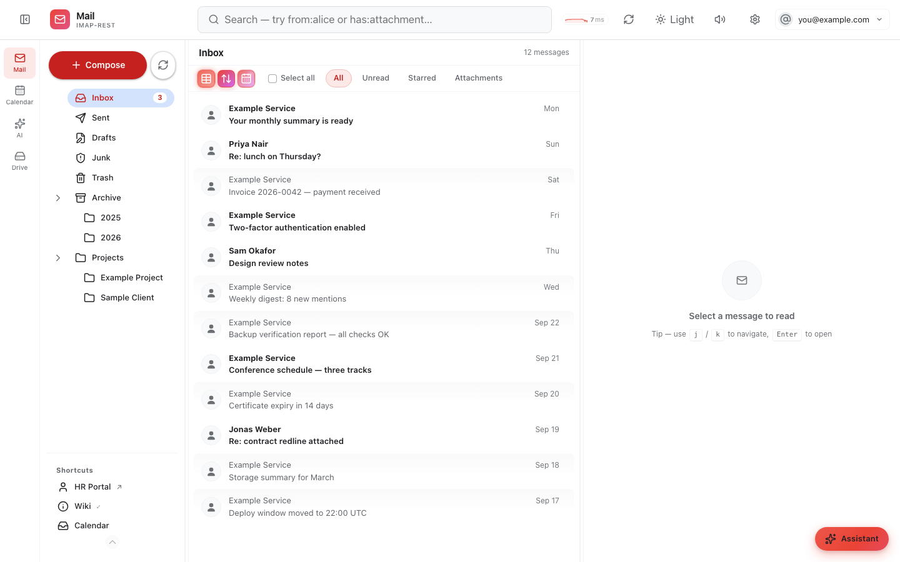
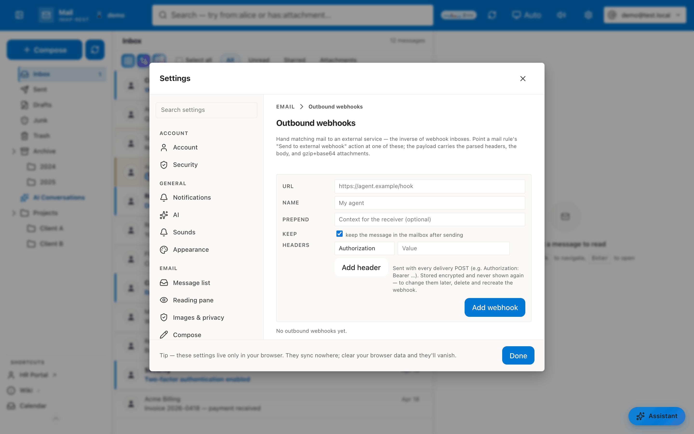
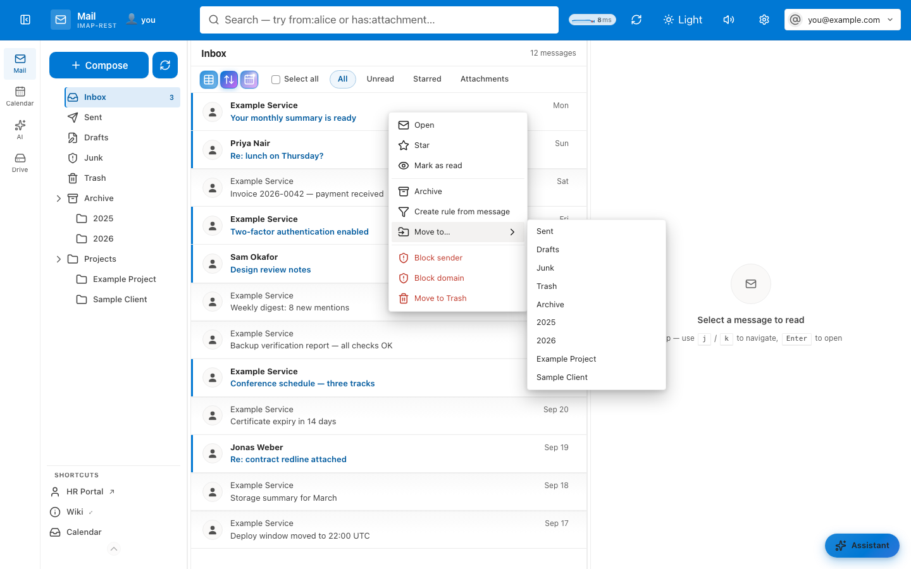
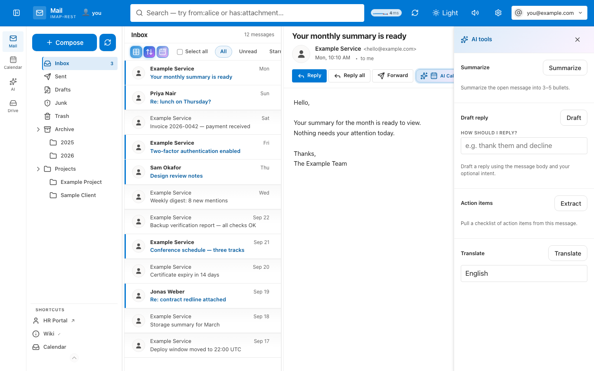
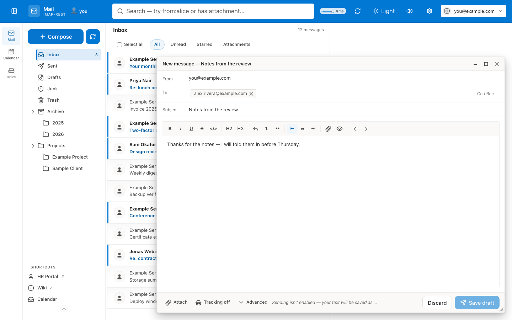
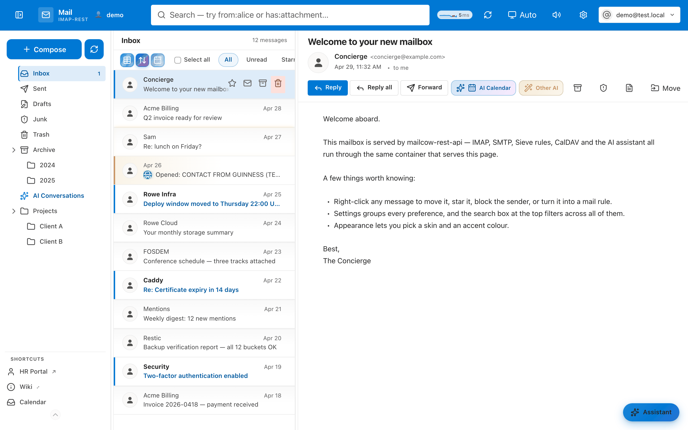
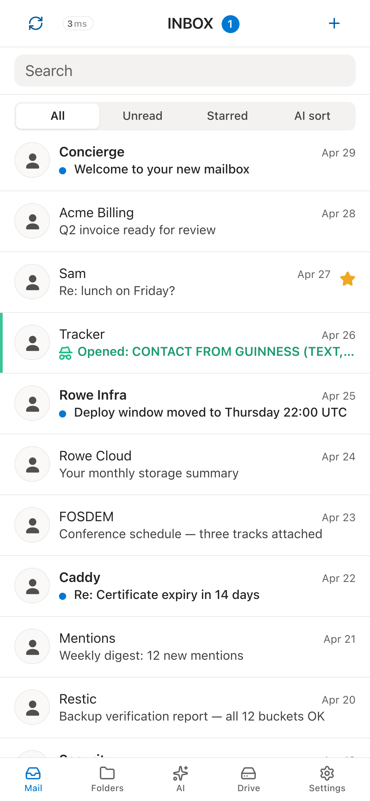

# Webmail (embedded SPA)

The Svelte 5 webmail frontend for [`mailcow-rest-api`](../README.md) — a desktop mail UI plus a mobile/PWA experience at `/webmail/mobile/`. Built into the API image and served at `/webmail/`, so there is nothing to deploy on its own and no version skew between API and frontend.

**Alpha:** public and usable, but still an alpha webmail client. Expect fast changes and rough edges in some workflows.


## Architecture


```mermaid
flowchart LR
    Browser[Browser / PWA] -->|/webmail/| API[mailcow-rest-api]
    Browser -->|/v1/*| API
    API --> IMAP[mailcow Dovecot IMAP]
    API --> SMTP[mailcow Postfix SMTP]
    API --> DB[mailcow MariaDB]
    API --> SOGo[SOGo CalDAV]
    API --> LLM[LLM provider]
```

Static client-side app — all mailbox and AI processing happens in the API, which also serves the built files. Same origin, so no CORS configuration is involved.

## Appearance

Two skins, each with a **customisable accent colour** plus a custom-CSS box under **Settings → Appearance**:



- **Outlook** — Outlook-on-the-web chrome. The default.
- **Gmail** — a Gmail rip-off: Material list, rounded rows, red Compose button with blue selection (pale in light, desaturated in dark).

The accent colour is a *layer*, not a third palette: it re-derives the accent family over whichever skin is active, so the chrome retints while the surfaces, type and shape stay the skin's own.

**Light/dark** comes from the topbar auto/light/dark toggle and works on both skins. Each skin carries its own dark palette: Outlook's is Fluent's dark neutrals under the familiar blue command bar, Gmail's is Material dark with the darker page and lighter message list. On **auto** the skin follows your OS, including live if you change it while the app is open.

One deliberate carry-over: Outlook's search field stays white with dark text in *both* light and dark, because Outlook-on-the-web does the same. It is not themed like the rest of the surface — see the comment in `skins.svelte.ts` for why swapping it onto the dark input token is a trap.

The two skins differ in one deliberate way: Outlook's header is a sparse blue command bar, so the weather chip and calendar ticker are hidden there by default (**Settings → Appearance → "Weather chip on Outlook themes"** brings the weather chip back). Gmail shows both.

## Settings

Every preference lives in one searchable modal. The left rail groups 19 sections under five headings — **Account**, **General**, **Email**, **Calendar**, **People** — the search box filters across all of them at once, and the panel reopens on whichever section you used last. The two sections that were only ever empty placeholders are gone rather than shown as dead ends.



## Context menu

Right-click any message for Open / Star / Read / Archive / **Create rule from message** / Block sender / **Block domain** / **Block root domain** / Trash. "Move to…" is a submenu rather than an inline folder list, so the menu stays a fixed handful of actions however many mailboxes the account has.

The three block items are one code path differing only in the pattern they apply: the exact address, `*@` the full host, or `*@` the registrable domain (so `deals@mail.promo.example.co.uk` offers `*@mail.promo.example.co.uk` and `*@example.co.uk` — the second is the one that catches a spammer rotating subdomains). Both wider options disappear when there is nothing useful to derive (no From address, an IP literal, or a host that is already its own root). The confirm dialog and the success toast name the exact pattern, because `*@example.co.uk` is a much bigger hammer than a single address.



## Screenshots

| | |
|---|---|
|  AI assistant panel |  Compose |
|  Message reading (dark) |  Mobile/PWA inbox |

## What it includes

- Desktop mailbox UI: folders, search, filters, message detail, attachments, compose, reply, forward, right-click context menu and multi-select.
- Calendar and drive views backed by the REST API.
- AI workflows for summarising, drafting, inbox sorting, action extraction, translation, phishing checks and TTS where configured.
- Tracking, sender policy, blocked recipients, shortcuts, density, theme, and PWA install surfaces.
- Mobile entry point with an iOS Mail-inspired layout for inbox, message reading, compose, folders and settings.

## AI and key privacy

The browser never receives a provider API key. AI requests go to `POST /v1/ai/llm/chat/completions` on the API, authenticated with the session token the client already holds; the server attaches the provider key and forwards the request. `GET /v1/ai/config` reports `proxied: true` and a same-origin base URL, so the client treats it like any other OpenAI-compatible endpoint.

This replaces an earlier design that brokered per-user scoped keys through LiteLLM and shipped them to the browser — handing a key to a public static frontend means anyone who can read the page can use it. Browser-local user keys still work for personal use (Settings → AI), but they are not a safe way to distribute one shared key to all users.

## Development

```sh
npm install
VITE_DEV_API_TARGET=http://localhost:3001 npm run dev
npm run check
npm run build          # writes webmail/dist/, excluded from the Docker context
```

Run these from this `webmail/` directory. `VITE_DEV_API_TARGET` points the Vite dev proxy at a local API; in production the API serves the built files directly and no proxy is involved.

To test a build the way production serves it, point the API at it:

```sh
cd .. && WEBMAIL_DIST=./webmail/dist npm start
# then open http://localhost:3001/webmail/
```

The API Swagger UI lives at `/` on the API service, or `/mailcow-rest-api/` if you use the public API setup script from the API repo.
